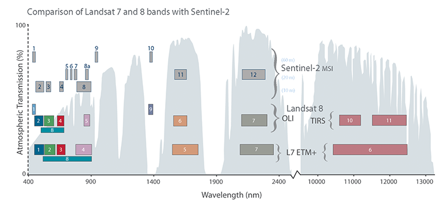

# snr_modeling

# SNR Modeling Introduction

## Goals of model:

1) Develop a single pixel model of VIS-NIR & thermal observations. Calculate the at-lens radiance for each band. Inputs for this are:
    - Reference solar spectrum
    - Blackbody temperature
    - Scene reflectance/ emissivity
    - (Optional) Atmospheric transmission

2) From first-order instrument parameters, calculate optical power from scene onto pixel and signal-to-noise ratio (SNR)/ or noise-equivalent differential temperature (NEDT)​.  
This requires first order optical, filter, and detector properties:  
    - Focal length
    - Aperture Diameter
    - Pixel pitch
    - Detectivity

3) Parameterize the pixel detectivity based on operational / environmental parameters (e.g. integration time, temperature).​  
Also, include a first-order contribution for lens and filter thermal emission (bb curve * residual coating emissivity), which will drive calibrations.  
Generate SNR/ NEDT over range of detector parameters​.

4) Run sensitivity studies based on scene model parameters, as well as system conditions of (3).

### Phase 1: Scene Signal Modeling

Blackbody radiance calculations complete with dimensional analysis (using Pint) are being developed in the HYTRAN module.  
In the meantime, an end-to-end SNR modeling prototype will be developed using a combination of validated pyspectral radiance functions and HYTRAN instrument models. (More on the complete planned HYTRAN capability later.)  

The below image is a great high-level example of what we're after. This is a visual comparison of the Landsat 7 vs. the Sentinel-2 bands vs. wavelength, superposed on a standard atmospheric transmission spectrum.

Atmospheric spectra will be a part of our model, but we will go one step further and dynamically model the *signal* of interest over the visible, NIR/SWIR bands dominated by solar reflectance as well as the thermal signal of longer wavelengths.

Dash app specific functions:
* Pick a reference spectrum from a dropdown
* Set a ground temperature
* Select a reference atmosphere, once we have data
* Pick an instrument band selection for display, as in above plot

All of the data for this phase can be conveniently held on the same x-axis of wavelength (we'll use microns). The bands for e.g. Landsat (except TIRS) & Sentinel-3 are already available through Pyspectral. ECOSTRESS/ ASTER reference spectra are available through SPy. See `spy_basics.ipynb` for simple interface setup, or `NEDT_calcs.ipynb` for a more complete treatment with HYTRAN.  
The script `spy_scene.py` is a much simpler reworking of the above studies, to enable quick development of a Dash application along the same lines. It outputs six total curves based on user-selected temperature, wavelength domain, and a reference reflecatance spectra. (Uses the standard TOA for solar and currently no atmosphere.)

Below is a plot of what `spy_scene.py` currently produces. Everything is all mashed up in one dataframe/ plot which needs some cleaning up!

## Dependencies
### HYTRAN
In-house python module for scene and instrument configuration to run performance modeling. Will support the inclusion of various spectral and atmospheric data once interfaces are defined.

### Pyspectral
A helpful if basic package that has similar goals for scene modeling as HYTRAN, plus some spectral response curves of various Earth observing instruments. Currently used features:
* [Spectral Response Functions](https://pyspectral.readthedocs.io/en/master/rsr_plotting.html)  
See `spy_basics.ipynb` for a test case with Sentinel-3 bands.  

* [Solar TOA Reference Spectrum and Blackbody Generation](https://pyspectral.readthedocs.io/en/master/rad_definitions.html)  
See the above spaghetti plot for an idea of how this all comes together.

### Spectral Python (SPy)
Containes ECOSTRESS spectra interface, basic set of hyperspectral imaging algorithms.
* https://www.spectralpython.net/libraries.html#ecostress-spectral-library  
See `spy_basics.ipynb` for a test case of a spectrum lookup. **Need a good user interface for Dash app.**  

## Goals of the Dash application

There are LOTS of knobs to turn with an instrument SNR model like this.  
The `configuration.ini` file is being developed to hold anything the user might change, and broken up in to the different HYTRAN classes that each set of inputs applies to. Hopefully, this will be a good roadmap for the inputs of a Dash application, which is ultimately meant to simplify the operation of the model and provide access to other users.

Kevin needs to stay focused on the modeling itself as this is a new effort for Hydrosat, but also knows more or less what he wants for front-end interface. Given the complexity of the full model, idea is to break into chunks (starting with Phase 1)

